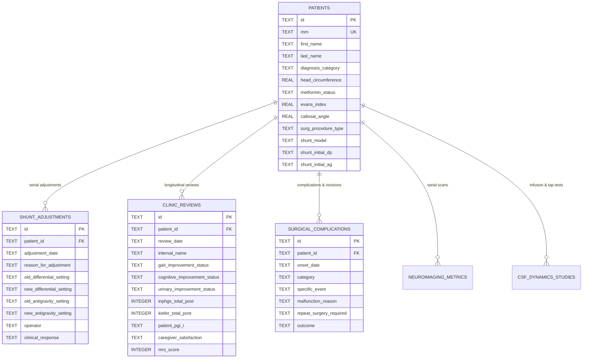

# Multi-disciplinary NPH & LOVA Database
## NPH & LOVA Clinical Registry & Database System

**Conceived, designed and tested: Dr G Narenthiran MB ChB BSc(MedSci) MRCS(Ed.) FEBNS FRCS(SN). Copyright 2026, Dr G Narenthiran, g_narenthiran@hotmail.com, all rights reserved.**  
by **Dr G Narenthiran MB ChB BSc(MedSci)(Hons) MRCS(Ed.) FEBNS FRCS(SN)**  
*Dedicated to Mrs Nirmaladevy Ganesalingam BSc.*

---

## 1. Relational Schema Architecture

The database is built on **SQLite 3** with foreign key enforcement enabled (`PRAGMA foreign_keys = ON;`). It incorporates a master `patients` entity with 1-to-many child relational tables to capture longitudinal serial adjustments, follow-up evaluations, and surgical revisions over decades.

---

## 2. Table Specifications & Data Dictionary

### Table: `patients`
Primary demographic, clinical, imaging, dynamic, surgical, and baseline score record.

| Field Name | Type | Constraints | Description & Clinical Grounding |
| :--- | :--- | :--- | :--- |
| `id` | TEXT | PRIMARY KEY | Unique UUID identifier |
| `mrn` | TEXT | UNIQUE, NOT NULL | Medical Record Number |
| `first_name` | TEXT | NOT NULL | Patient given name |
| `last_name` | TEXT | NOT NULL | Patient family name |
| `diagnosis_category` | TEXT | NOT NULL | `iNPH`, `sNPH`, `LOVA`, `Mixed`, `Under Evaluation` |
| `dob` | TEXT | | Date of birth (ISO 8601 YYYY-MM-DD) |
| `age` | INTEGER | | Age at presentation (years) |
| `gender` | TEXT | | `Male`, `Female`, `Other` |
| `handedness` | TEXT | | `Right`, `Left`, `Ambidextrous` |
| `head_circumference` | REAL | | Occipitofrontal circumference (cm). Macrocephaly: &gt;58cm (M), &gt;56cm (F). Vital for LOVA. |
| `height` | REAL | | Height (cm) |
| `weight` | REAL | | Weight (kg) |
| `childhood_large_hat_size` | INTEGER | | Boolean flag: childhood large hat size / macrocephaly history |
| `delayed_motor_milestones`| INTEGER | | Boolean flag: delayed childhood walking / motor milestones |
| `craniofacial_disproportion`| INTEGER | | Boolean flag: frontal bossing / craniofacial disproportion |
| `prev_neck_surgery` | INTEGER | | Boolean flag: prior anterior neck surgery / tracheostomy |
| `prev_neck_notes` | TEXT | | Description of neck procedures |
| `prev_chest_surgery` | INTEGER | | Boolean flag: prior thoracotomy, pleurodesis, sternotomy |
| `prev_chest_notes` | TEXT | | Viability of ventriculopleural / VA catheter |
| `prev_abdo_surgery` | INTEGER | | Boolean flag: laparotomy, peritonitis, hernia, adhesions |
| `prev_abdo_notes` | TEXT | | Peritoneal absorption and laparoscopy considerations |
| `prev_head_injury` | INTEGER | | Boolean flag: prior traumatic brain injury (TBI) |
| `prev_neurosurgery` | INTEGER | | Boolean flag: prior craniotomy or CSF shunt |
| `prev_cns_infection` | INTEGER | | Boolean flag: prior meningitis, ventriculitis, arachnoiditis |
| `prev_sah` | INTEGER | | Boolean flag: prior subarachnoid hemorrhage |
| `metformin_status` | TEXT | | `Never`, `Active`, `Past`, `Unknown` |
| `metformin_daily_dose` | TEXT | | Daily dosage (e.g. 500mg bd, 1000mg od) |
| `metformin_duration_years` | REAL | | Years of continuous exposure |
| `metformin_indication` | TEXT | | `Type 2 Diabetes`, `Prediabetes`, `PCOS`, `Longevity` |
| `metformin_glymphatic_notes`| TEXT | | Observations regarding glymphatics, CSF clearance, metabolic profile |
| `obesity_status` | INTEGER | | Boolean flag: BMI &ge; 30 kg/m&sup2; |
| `obesity_grade` | TEXT | | `None`, `Class 1`, `Class 2`, `Class 3` |
| `anticoagulation_antiplatelet`| TEXT | | DOACs, Warfarin, Clopidogrel, Aspirin |
| `gait_severity` | TEXT | | 0 to 4 functional scale |
| `gait_magnetic` | INTEGER | | Magnetic / glued-to-the-floor gait |
| `gait_broad_based` | INTEGER | | Broad-based stance |
| `gait_short_steps` | INTEGER | | Short-shuffled steps |
| `gait_turning_steps` | INTEGER | | Multi-step turn (&gt;3 steps for 180&deg;) |
| `gait_freezing` | INTEGER | | Motor block / freezing of gait |
| `gait_falls` | INTEGER | | Unprovoked falls history |
| `falls_frequency` | TEXT | | E.g. 2 per month |
| `cog_severity` | TEXT | | 0 to 4 subcortical cognitive grade |
| `cog_bradyphrenia` | INTEGER | | Slowed cognitive processing speed |
| `cog_executive` | INTEGER | | Executive dysfunction |
| `cog_apathy` | INTEGER | | Apathy / abulia |
| `baseline_moca` | INTEGER | | Montreal Cognitive Assessment (/30) |
| `baseline_mmse` | INTEGER | | Mini-Mental State Examination (/30) |
| `urinary_severity` | TEXT | | 0 to 4 continence impairment scale |
| `urinary_urgency` | INTEGER | | Bladder hyperactivity / rush to toilet |
| `urinary_nocturia` | INTEGER | | Severe nocturia (&ge;3x per night) |
| `urinary_lack_concern` | INTEGER | | Frontal lack of concern regarding wetting |
| `lova_headache` | INTEGER | | Morning / episodic headache (LOVA hallmark) |
| `lova_visual_obscurations`| INTEGER | | Transient visual darkening / diplopia |
| `lova_papilledema` | INTEGER | | Papilledema / chronic optic disc pallor |
| `symptoms_duration_months` | INTEGER | | Total duration of symptoms prior to referral |
| `excl_ad` | TEXT | | Alzheimer's exclusion status |
| `excl_pd` | TEXT | | Parkinson's exclusion status |
| `excl_psp` | TEXT | | Progressive Supranuclear Palsy exclusion status |
| `excl_msa` | TEXT | | Multiple System Atrophy / CBD exclusion |
| `excl_dlb` | TEXT | | Dementia with Lewy Bodies exclusion |
| `excl_vad` | TEXT | | Vascular Dementia / Binswanger status |
| `excl_csm` | TEXT | | Cervical Spondylotic Myelopathy exclusion |
| `excl_lss` | TEXT | | Lumbar Spinal Stenosis exclusion |
| `excl_neuropathy` | TEXT | | Peripheral Neuropathy exclusion |
| `mdt_decision` | TEXT | | Multidisciplinary consensus recommendation |
| `evans_index` | REAL | | Frontal horn ratio (&gt;0.30 denotes ventriculomegaly) |
| `callosal_angle` | REAL | | Coronal angle in degrees (&lt;90&deg; in iNPH) |
| `temporal_horns_width` | REAL | | Temporal horns width in mm (&ge;4mm enlarged) |
| `third_ventricle_width` | REAL | | 3rd ventricle width in mm |
| `desh_tight_vertex` | INTEGER | | High-convexity sulcal effacement |
| `desh_sylvian_dilation` | INTEGER | | Sylvian fissure enlargement |
| `desh_focal_sulcal_dilation`| INTEGER | | Focal sulcal dilation |
| `lova_aqueduct_stenosis` | INTEGER | | Aqueductal web / diaphragm / occlusion |
| `lova_prepontine_membranes`| INTEGER | | Thickened Membrane of Liliequist / retroclival web |
| `lova_third_ventricle_bowing`| INTEGER | | Downward herniation/bowing of 3rd ventricle floor |
| `lova_sella_expansion` | INTEGER | | Remodeled expanded sella turcica / empty sella |
| `lova_calvarial_thinning` | INTEGER | | Endocranial scalloping / bone thinning |
| `lova_flow_void` | INTEGER | | Jet flow void on T2/phase-contrast MRI |
| `radscale_total` | INTEGER | | iNPH Radscale (0 - 12) |
| `tap_volume` | REAL | | Volume of CSF drained (ml) |
| `tap_pre_walk_time` | REAL | | Pre-tap 10m walk time (seconds) |
| `tap_post_walk_time` | REAL | | Post-tap 10m walk time (seconds) |
| `inf_rout` | REAL | | Outflow resistance Rout (mmHg/ml/min) |
| `surg_procedure_type` | TEXT | | VP, LP, VA, Ventriculopleural, ETV, ETV+Membrane |
| `surg_liliequist_disrupted`| INTEGER | | Disruption of prepontine arachnoid membranes |
| `shunt_manufacturer` | TEXT | | Miethke, Codman, Medtronic, Sophysa, Integra |
| `shunt_model` | TEXT | | E.g. proGAV 2.0 with proSA, Certas Plus, Strata |
| `shunt_initial_dp` | TEXT | | Initial differential pressure setting (e.g. 10 cmH2O) |
| `shunt_initial_ag` | TEXT | | Initial anti-gravity setting (e.g. 20 cmH2O) |
| `inphgs_pre_total` | INTEGER | | Pre-op iNPHGS (0 - 12) |
| `inphgs_post_total` | INTEGER | | Post-op iNPHGS (0 - 12) |
| `kiefer_pre_total` | INTEGER | | Pre-op Kiefer Scale (0 - 20) |
| `kiefer_post_total` | INTEGER | | Post-op Kiefer Scale (0 - 20) |

---

### Table: `shunt_adjustments`
Log of non-invasive magnetic valve reprogramming.

| Field Name | Type | Description |
| :--- | :--- | :--- |
| `id` | TEXT PK | Unique adjustment ID |
| `patient_id` | TEXT FK | References `patients.id` |
| `adjustment_date` | TEXT | Date of setting change |
| `operator` | TEXT | Clinician / Surgeon performing calibration |
| `reason_for_adjustment` | TEXT | Overdrainage, underdrainage, subdural collection, slit ventricles |
| `old_differential_setting`| TEXT | Pre-adjustment differential value |
| `new_differential_setting`| TEXT | Reprogrammed differential value |
| `old_antigravity_setting` | TEXT | Pre-adjustment anti-gravity setting |
| `new_antigravity_setting` | TEXT | Reprogrammed anti-gravity setting |
| `clinical_response` | TEXT | Symptomatic outcome after adjustment |

---

### Table: `clinic_reviews`
Follow-up clinic reviews, clinical scores, and patient/family satisfaction ratings.

| Field Name | Type | Description |
| :--- | :--- | :--- |
| `id` | TEXT PK | Unique review ID |
| `patient_id` | TEXT FK | References `patients.id` |
| `review_date` | TEXT | Date of clinic encounter |
| `interval_name` | TEXT | 6 weeks, 3 months, 6 months, 12 months, 2 years, etc. |
| `gait_improvement_status` | TEXT | Markedly improved, moderately improved, unchanged, deteriorated |
| `cognitive_improvement_status`| TEXT| Improved, unchanged, worse |
| `urinary_improvement_status` | TEXT | Resolved/dry, improved urgency, unchanged, worse |
| `inphgs_total_post` | INTEGER | Follow-up iNPHGS (0 - 12) |
| `kiefer_total_post` | INTEGER | Follow-up Kiefer score (0 - 20) |
| `patient_pgi_i` | TEXT | Patient Global Impression of Improvement (1 - 7) |
| `caregiver_satisfaction` | TEXT | Family/caregiver satisfaction (1 - 5) |
| `mrs_score` | INTEGER | Modified Rankin Scale (0 - 6) |

---

### Table: `surgical_complications`
Acute and chronic adverse events, shunt malfunctions, and surgical revisions.

| Field Name | Type | Description |
| :--- | :--- | :--- |
| `id` | TEXT PK | Unique complication ID |
| `patient_id` | TEXT FK | References `patients.id` |
| `onset_date` | TEXT | Date of event / diagnosis |
| `category` | TEXT | Overdrainage (hygroma/hematoma), mechanical malfunction, infection |
| `specific_event` | TEXT | Detailed clinical diagnosis |
| `malfunction_reason` | TEXT | Proximal catheter block, valve debris, distal obstruction, fracture |
| `repeat_surgery_required` | TEXT | Proximal revision, valve swap, distal revision, complete shunt, ETV |
| `outcome` | TEXT | Post-revision resolution status |

---

### Table: `revision_shunt_surgeries`
Log of operative shunt revisions, component swaps, anti-gravity valve additions, and catheter repositioning.

| Field Name | Type | Description |
| :--- | :--- | :--- |
| `id` | TEXT PK | Unique revision surgery record ID |
| `patient_id` | TEXT FK | References `patients.id` |
| `surgery_date` | TEXT | Date of revision surgery |
| `lead_surgeon` | TEXT | Primary operating neurosurgeon |
| `assistant_surgeon` | TEXT | Assistant neurosurgeon / registrar |
| `revision_indication` | TEXT | Proximal occlusion, valve clogging, distal block, overdrainage, infection, etc. |
| `components_revised` | TEXT | Proximal, valve, anti-gravity unit, distal, complete system, EVD, secondary ETV |
| `cranial_entry_site` | TEXT | Same Kocher burr hole, contralateral, Keen point, new entry |
| `new_hardware_model` | TEXT | New valve model (e.g. Miethke proGAV 2.0 with proSA) |
| `new_differential_setting`| TEXT | Differential pressure setting (e.g. 12 cmH2O) |
| `new_antigravity_setting` | TEXT | Anti-gravity valve setting (e.g. 25 cmH2O) |
| `new_catheter_type` | TEXT | Bactiseal, Silverline, standard |
| `csf_microbiology_sent` | INTEGER | Boolean flag: intraoperative CSF sent for microscopy & culture |
| `operative_findings` | TEXT | Intraoperative CSF appearance, flow, tissue ingrowth, hardware status |
| `immediate_outcome` | TEXT | Post-operative CT, resolution of malfunction, discharge course |

---

### Table: `other_surgeries`
Log of non-shunt neurosurgical, spinal, abdominal, and reconstructive procedures.

| Field Name | Type | Description |
| :--- | :--- | :--- |
| `id` | TEXT PK | Unique procedure record ID |
| `patient_id` | TEXT FK | References `patients.id` |
| `procedure_date` | TEXT | Date of surgical procedure |
| `procedure_name` | TEXT | Procedure title (e.g. Burr Hole Evacuation of Subdural Hygroma / Hematoma) |
| `surgical_category` | TEXT | Cranial, spine, abdominal surgery, interventional radiology, wound repair |
| `lead_surgeon` | TEXT | Operating surgeon / interventionalist |
| `anesthesia_type` | TEXT | General anesthesia, local + sedation, local |
| `indication` | TEXT | Clinical rationale and mass effect / pathology treated |
| `operative_summary` | TEXT | Operative technique and intraoperative findings |
| `complications` | TEXT | Procedural complications (bleeding, infection, CSF leak) |
| `clinical_outcome` | TEXT | Resolution status, brain re-expansion, follow-up plan |
